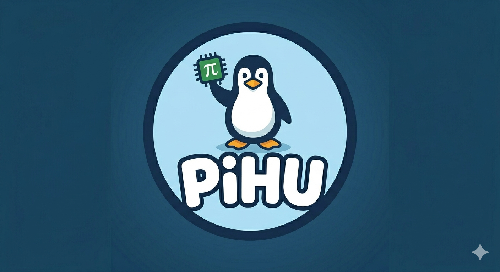
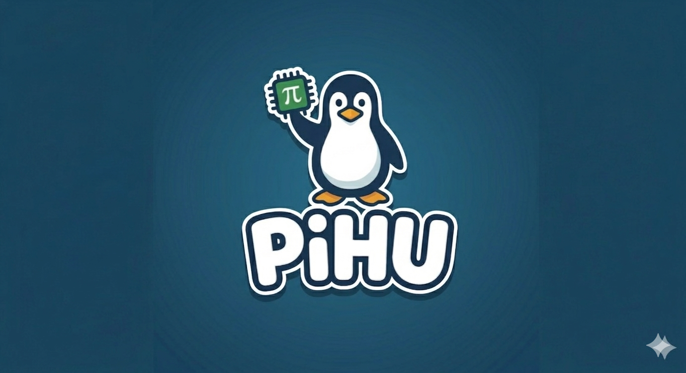
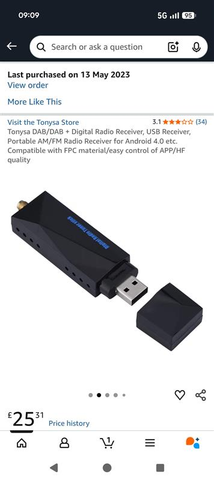
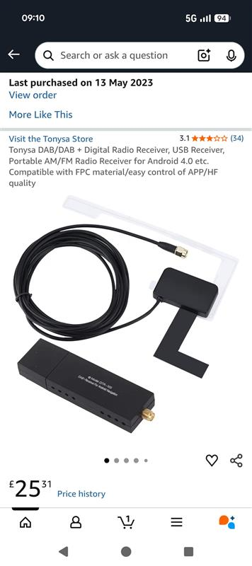
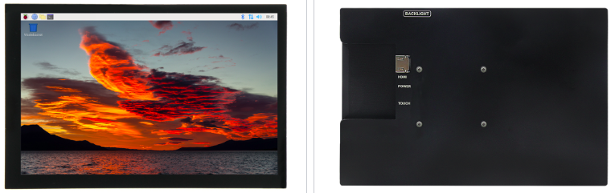
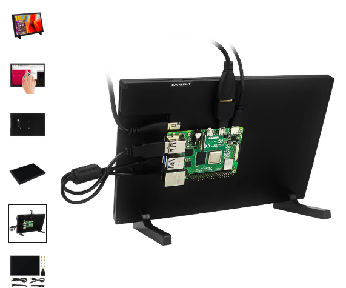
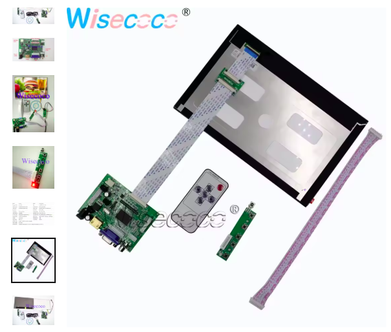
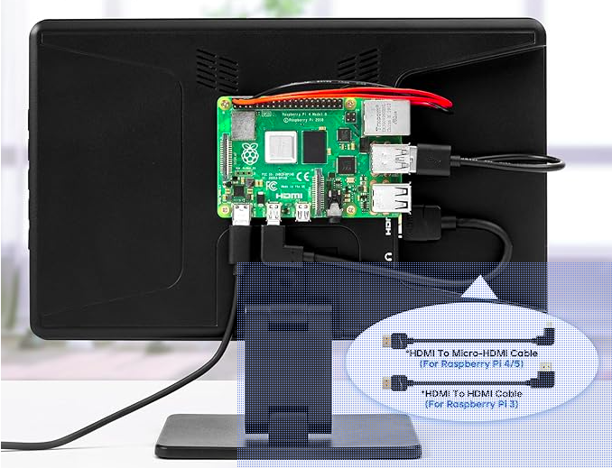
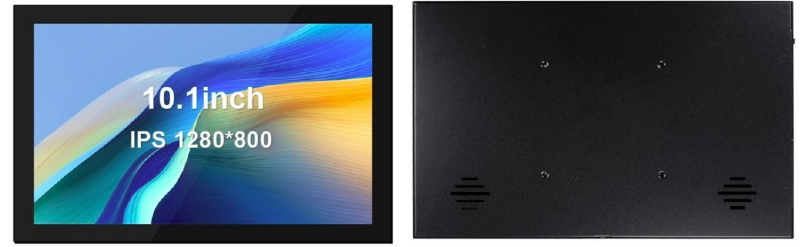
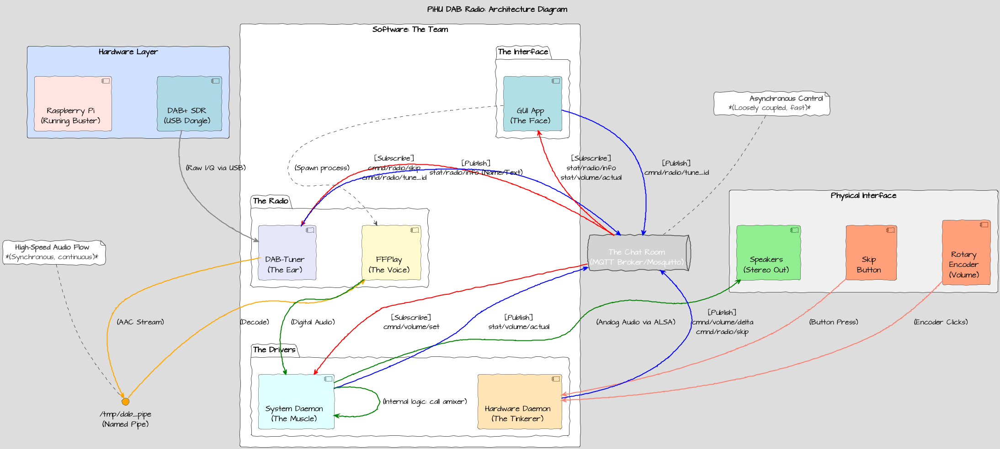

# PiHU

A Pi based Linux headunit from my car.  

I currently have a cheap chinese 10.1" Android head unit.  This can do Android Auto and Dab Radio but does have it's issues.  Sometimes it loosed Audio after a short stop and requres a reboot - not very conveniuent while driving.    

I'll document the development as I go, including my discussions with Gemenai and Co-Pilot. (Don't tell Gemenai I'm talking with Co-Pilot,  he'll get jellous)

# Logo

First things first,  Desing a logo with Gemani

| 1                             | 2                             |
| ----------------------------- | ----------------------------- |
|  |  |

# The Plan

Make some requirments

- Simple fun GUI
- Supports OpenAuto Somehow 
- Supports Dab Radio
- Using Buster ( becuase apparently this is what OpenAuto requires )

# GUI Mockup

Something like this but not this compex

| mockup 1 | notes |
| -- | -- |
|  | Too much info to see |
|  | |


Full details on the Gui develoment [here](gui/README.md)

# Dab Radio integration

This is the dongle I currently have.
Its apparenly a keystone dab chip rathern than a SDR based dongle.  

| 1 | 2 |
| -- | -- |
|  |  |

Full details on Dab intergration [here](dab/README.md)


# MQTT

Why have seperate Apps and communicte between them with MQTT.


[discussions](discussions/mqtt.md)

Topics

| topic                     | description                                       |
| ------------------------- | ------------------------------------------------- |
| car/speed                 |                                                   |
| car/HU/bg_image           | index of backgrond image to display - for testing |
| car/HU/volume             | 0% - 100% volume                                  |
| car/dab/set_station       | request a station <frequency subchannel bitrate>  |
| car/dab/frequency         | current                                           |
| car/dab/subchannel        | current                                           |
| car/dab/bitrate           | current                                           |
| car/dab/programme_type    | current                                           |
| car/dab/programme_service | current                                           |
| car/dab/ensemble          | current                                           |

## How to install mosquito

install:

```bash
sudo apt install mosquitto mosquitto-clients
```

start:

```bash
sudo systemctl enable mosquitto
sudo systemctl start mosquitto
```

or

```
docker exec -it gracious_rubin mosquitto

mosquitto_pub -h localhost -t car/speed -m "60"
```

## OpenAuto

So this is the nightmare bit. I have tried and fails multiple times to install and build OpenAuto.

https://github.com/opencardev/openauto

Crankshaft did work, but its not quite what I want.

links:

https://github.com/opencardev/prebuilts


installations

## Hardware

I still need to get some more hardware,
I have a number of things in AliBaba Basket.


### Screen

The question is,  do I strip down my current using and try and reuse the existing panel and touch.   
Do I use enclosure and replace the panel inside?
Do I get a full in replacement panel and enclosure?
Or do i get a barebone panel and make a new enclosure?

| option | brigtness | enclosude | price |
| -- | -- | -- | -- |
|
  10.1 inch 1280x800 IPS MPI1008 http://www.lcdwiki.com/10.1inch_HDMI_Display-Y | 220cd/m2 button addjustment  | plastic | ~£50 |
|  | 350 cd/m2 | none | ~£50 |
|  10.1 Inch 1280*800 TFT EJ101IA-01G HD LCD Display Touch Screen Remote Driver Board 2AV VGA For Raspberry Pi 3 [AliEpress](https://www.aliexpress.com/item/32920662451.html?spm=a2g0o.productlist.main.5.493a753ezUSlru&algo_pvid=bfda887a-1491-4815-ba0a-dcd24c721d4c&algo_exp_id=bfda887a-1491-4815-ba0a-dcd24c721d4c-4&pdp_ext_f=%7B%22order%22%3A%2217%22%2C%22eval%22%3A%221%22%2C%22fromPage%22%3A%22search%22%7D&pdp_npi=6%40dis%21GBP%2158.30%2140.81%21%21%2174.88%2152.41%21%40211b612517753430462841646e6a3c%2112000042152825609%21sea%21UK%210%21ABX%211%210%21n_tag%3A-29910%3Bd%3A72912a7b%3Bm03_new_user%3A-29895%3BpisId%3A5000000197842856&curPageLogUid=T1BA53JcnbQe&utparam-url=scene%3Asearch%7Cquery_from%3A%7Cx_object_id%3A32920662451%7C_p_origin_prod%3A) | 350 cd/m2 | none | ~£50 |
|  ROADOM Touch Screen with Case, 10.1’’ Raspberry Pi Screen, IPS FHD 1024×600,Responsive and Smooth Touch,Dual Built-in Speakers,HDMI Input,Compatible with Raspberry Pi 5/4/3/Zero [Amazon](https://www.amazon.co.uk/ROADOM-Raspberry-1024%C3%97600-Responsive-Compatible/dp/B0DPW4KDR8/ref=asc_df_B0DPW4KDR8?mcid=8b5602a71926328baf9a6775c58ac75d&tag=googshopuk-21&linkCode=df0&hvadid=732381739151&hvpos=&hvnetw=g&hvrand=12352195671574543887&hvpone=&hvptwo=&hvqmt=&hvdev=c&hvdvcmdl=&hvlocint=&hvlocphy=9045980&hvtargid=pla-2402559317518&hvocijid=12352195671574543887-B0DPW4KDR8-&hvexpln=0&gad_source=1&th=1) | | plastic | £69 |
|  10.1 inch 1280x800 Capacitive Touch Screen. Connections on side.  NOT SUITABLE https://www.lcdwiki.com/10.1inch_HDMI_Display-S | 250 cd/m2 rotarty adjusrment | metal | |


### Amplifier

This is being delivered today.    

### Power

todo

## Architecture diragram so far


<details>
<summary>View UML</summary>

```uml
title PiHU DAB Radio: Architecture Diagram
 
' --- Defining Icons and Components ---
skinparam componentStyle uml2
skinparam nodesep 100
skinparam ranksep 100
 
rectangle "Physical Interface" as Phys #f0f0f0 {
    [🔊\nSpeakers\n(Stereo Out)] as Speakers <<$output_devices>> #lightgreen
    [🔄\nRotary\nEncoder\n(Volume)] as Knob <<$input_devices>> #lightsalmon
    [⏭️\nSkip\nButton] as Button <<$input_devices>> #lightsalmon
}
 
rectangle "Hardware Layer" as HW #d0e0ff {
    [📡\nDAB+ SDR\n(USB Dongle)] as SDR <<$hardware>> #lightblue
    [🍓\nRaspberry Pi\n(Running Buster)] as Pi <<$microchip>> #mistyrose
}
 
' --- Defining Software Processes (The Fun Stuff) ---
rectangle "Software: The Team" as SW #fff {
 
    package "The Interface" as PackageGUI #white {
        [📺\nGUI App\n(The Face)] as GUI <<(P,#ADD8E6)>> #powderblue
    }
 
    package "The Drivers" as PackageDrivers #white {
        [🎧\nSystem Daemon\n(The Muscle)] as System <<(P,#ADD8E6)>> #lightcyan
        [🛠️\nHardware Daemon\n(The Tinkerer)] as HWDae <<(P,#ADD8E6)>> #moccasin
    }
 
    package "The Radio" as PackageRadio #white {
        [📻\nDAB-Tuner\n(The Ear)] as Tuner <<(P,#ADD8E6)>> #lavender
        [🎼\nFFPlay\n(The Voice)] as FFplay <<(P,#ADD8E6)>> #lemonchiffon
    }
}
 
' --- Communication Nodes ---
queue "The Chat Room\n(MQTT Broker/Mosquitto)" as MQTT <<$network>> #lightgray
 
() "/tmp/dab_pipe\n(Named Pipe)" as FIFO <<$folder>> #orange
 
' --- Interconnections & Action Flows ---
 
' 1. Output Path (The Main Event)
SDR -[#gray,thickness=2]-> Tuner : (Raw I/Q via USB)
Tuner -[#orange,dashed,bold,thickness=3]-> FIFO : (AAC Stream)
FIFO -[#orange,dashed,bold,thickness=3]-> FFplay : (Decode)
FFplay -[#green,thickness=2]-> System : (Digital Audio)
System -[#green,bold,thickness=2]-> Speakers : (Analog Audio via ALSA)
 
' 2. Input Path (Volume & Skip)
Knob -[#salmon,thickness=2]-> HWDae : (Encoder Clicks)
Button -[#salmon,thickness=2]-> HWDae : (Button Press)
HWDae -[#blue,bold,thickness=2]-> MQTT : [Publish]\ncmnd/volume/delta\ncmnd/radio/skip
 
' 3. Control Loops (The Brain)
' Volume
MQTT -[#red,thickness=2]-> System : [Subscribe]\ncmnd/volume/set
System -[#green,thickness=2]-> System : (Internal logic: call amixer)
System -[#blue,thickness=2]-> MQTT : [Publish]\nstat/volume/actual
 
' Tune/Skip
MQTT -[#red,thickness=2]-> Tuner : [Subscribe]\ncmnd/radio/skip\ncmnd/radio/tune_id
Tuner -[#blue,thickness=2]-> MQTT : [Publish]\nstat/radio/info (Name/Text)
 
' 4. The GUI (Observation & Control)
GUI -[#blue,thickness=2]-> MQTT : [Publish]\ncmnd/radio/tune_id
MQTT -[#red,thickness=2]-> GUI : [Subscribe]\nstat/radio/info\nstat/volume/actual
 
' Optional Connection: GUI spawning FFplay
GUI ..> FFplay : (Spawn process)
 
' --- Legend/Notes (Fun Icons) ---
note top of MQTT #white
  ⚡️ **Asynchronous Control**
  *(Loosely coupled, fast)*
end note
 
note top of FIFO #white
  **High-Speed Audio Flow**
  *(Synchronous, continuous)*
end note
```
</details>


