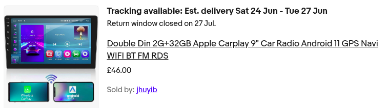

# PiHU

A Pi based Linux headunit from my car.

I currently have a cheap chinese 9" Android head unit. This can do Android Auto and Dab Radio but does have it's issues. Sometimes it loosed Audio after a short stop and requres a reboot - not very conveniuent while driving.

I'll document the development as I go, including my discussions with Gemini and Co-Pilot. (Don't tell Gemini I'm talking with Co-Pilot, he'll get jellous)

# Logo

First things first, Desing a logo with Gemani

| 1                             | 2                             |
| ----------------------------- | ----------------------------- |
|  |  |

# The Plan

Make some requirments

- Simple fun GUI
- Supports OpenAuto Somehow
- Supports Dab Radio
- Using Buster ( becuase apparently this is what OpenAuto requires )

# GUI Mockup

Something like this but not this compex

| mockup 1                      | notes                |
| ----------------------------- | -------------------- |
|  | Too much info to see |
|       |                      |

Full details on the Gui develoment [here](gui/README.md)

# Dab Radio integration

This is the dongle I currently have.
Its apparenly a keystone dab chip rathern than a SDR based dongle.

| 1                               | 2                               |
| ------------------------------- | ------------------------------- |
|  |  |

Full details on Dab intergration [here](dab/README.md)

# MQTT

Why have seperate Apps and communicte between them with MQTT.

[discussions](discussions/mqtt.md)

Topics

| topic                     | description                                                  |
| ------------------------- | ------------------------------------------------------------ |
| car/speed                 |                                                              |
| car/HU/bg_image           | index of backgrond image to display - for testing            |
| car/HU/volume             | 0% - 100% volume                                             |
| car/dab/tune_to           | tune_to message sent from GUI to tunner                      |
| car/dab/current_programme | published by tuner                                           |
| car/dab/now_plating       | published by tuner                                           |
| car/deb/seek              | sent from GUI to tunner { "seek":"up" } or { "seek":"down" } |

tune_to messgae:

```
{
    "frequency":1234,
    "subchannel":1,
    "bitrate":64,
}
```

current_programme message:

```
{
  "frequency": 230640,
  "service": {
    "label": "BBC 6 Music",
    "short_label": "BBC 6M"},
  "type": "music",
  "ensemble": "London N",
  "bitrate": 128,
  "dab_plus": 1
}

```

now_plating message:

```
{
    "todo"
}

```

## How to install mosquito

install:

```bash
sudo apt install mosquitto mosquitto-clients
```

start:

```bash
sudo systemctl enable mosquitto
sudo systemctl start mosquitto
```

or

```
docker exec -it gracious_rubin mosquitto

mosquitto_pub -h localhost -t car/speed -m "60"
```

## OpenAuto

So this is the nightmare bit. I have tried and fails multiple times to install and build OpenAuto.

https://github.com/opencardev/openauto

Crankshaft did work, but its not quite what I want.

links:

https://github.com/opencardev/prebuilts

installations

## Current Android Head Unit

This is my current Cheap Chinese android head unit which I got on ebay for £46



- 1024x600

## Hardware

I still need to get some more hardware,
I have a number of things in AliBaba Basket.

### Screen

My current feeling is that the only viable solution is to get 3 parts

- case
- 9" screen and hdmi board
- digitiser

See here for full details [here](display/README.md)

### Amplifier

This is being delivered today.

### Power

todo

## Architecture diragram so far


<details>
<summary>View UML</summary>

```uml
title PiHU DAB Radio: Architecture Diagram

' --- Defining Icons and Components ---
skinparam componentStyle uml2
skinparam nodesep 100
skinparam ranksep 100

rectangle "Physical Interface" as Phys #f0f0f0 {
    [🔊\nSpeakers\n(Stereo Out)] as Speakers <<$output_devices>> #lightgreen
    [🔄\nRotary\nEncoder\n(Volume)] as Knob <<$input_devices>> #lightsalmon
    [⏭️\nSkip\nButton] as Button <<$input_devices>> #lightsalmon
}

rectangle "Hardware Layer" as HW #d0e0ff {
    [📡\nDAB+ SDR\n(USB Dongle)] as SDR <<$hardware>> #lightblue
    [🍓\nRaspberry Pi\n(Running Buster)] as Pi <<$microchip>> #mistyrose
}

' --- Defining Software Processes (The Fun Stuff) ---
rectangle "Software: The Team" as SW #fff {

    package "The Interface" as PackageGUI #white {
        [📺\nGUI App\n(The Face)] as GUI <<(P,#ADD8E6)>> #powderblue
    }

    package "The Drivers" as PackageDrivers #white {
        [🎧\nSystem Daemon\n(The Muscle)] as System <<(P,#ADD8E6)>> #lightcyan
        [🛠️\nHardware Daemon\n(The Tinkerer)] as HWDae <<(P,#ADD8E6)>> #moccasin
    }

    package "The Radio" as PackageRadio #white {
        [📻\nDAB-Tuner\n(The Ear)] as Tuner <<(P,#ADD8E6)>> #lavender
        [🎼\nFFPlay\n(The Voice)] as FFplay <<(P,#ADD8E6)>> #lemonchiffon
    }
}

' --- Communication Nodes ---
queue "The Chat Room\n(MQTT Broker/Mosquitto)" as MQTT <<$network>> #lightgray

() "/tmp/dab_pipe\n(Named Pipe)" as FIFO <<$folder>> #orange

' --- Interconnections & Action Flows ---

' 1. Output Path (The Main Event)
SDR -[#gray,thickness=2]-> Tuner : (Raw I/Q via USB)
Tuner -[#orange,dashed,bold,thickness=3]-> FIFO : (AAC Stream)
FIFO -[#orange,dashed,bold,thickness=3]-> FFplay : (Decode)
FFplay -[#green,thickness=2]-> System : (Digital Audio)
System -[#green,bold,thickness=2]-> Speakers : (Analog Audio via ALSA)

' 2. Input Path (Volume & Skip)
Knob -[#salmon,thickness=2]-> HWDae : (Encoder Clicks)
Button -[#salmon,thickness=2]-> HWDae : (Button Press)
HWDae -[#blue,bold,thickness=2]-> MQTT : [Publish]\ncmnd/volume/delta\ncmnd/radio/skip

' 3. Control Loops (The Brain)
' Volume
MQTT -[#red,thickness=2]-> System : [Subscribe]\ncmnd/volume/set
System -[#green,thickness=2]-> System : (Internal logic: call amixer)
System -[#blue,thickness=2]-> MQTT : [Publish]\nstat/volume/actual

' Tune/Skip
MQTT -[#red,thickness=2]-> Tuner : [Subscribe]\ncmnd/radio/skip\ncmnd/radio/tune_id
Tuner -[#blue,thickness=2]-> MQTT : [Publish]\nstat/radio/info (Name/Text)

' 4. The GUI (Observation & Control)
GUI -[#blue,thickness=2]-> MQTT : [Publish]\ncmnd/radio/tune_id
MQTT -[#red,thickness=2]-> GUI : [Subscribe]\nstat/radio/info\nstat/volume/actual

' Optional Connection: GUI spawning FFplay
GUI ..> FFplay : (Spawn process)

' --- Legend/Notes (Fun Icons) ---
note top of MQTT #white
  ⚡️ **Asynchronous Control**
  *(Loosely coupled, fast)*
end note

note top of FIFO #white
  **High-Speed Audio Flow**
  *(Synchronous, continuous)*
end note
```

</details>
