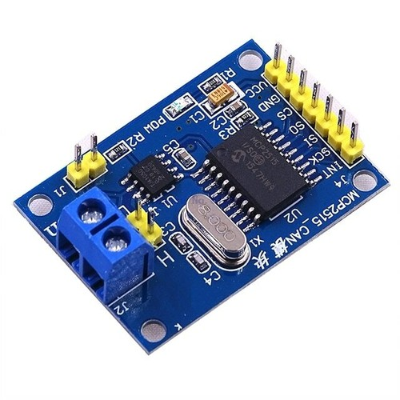
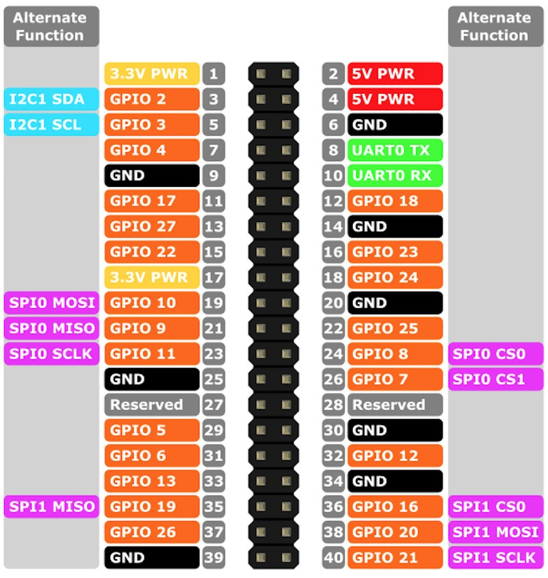

# CanBus

Mcp2515 CAN Bus Module TJA1050 Receiver SPI Module



The plan is to connect this to PI via

| MCP2515 Pin | Raspberry Pi Pin Name | Physical Pin Number | Function                                   |
| ----------- | --------------------- | ------------------- | ------------------------------------------ |
| VCC         | 3.3V Power            | Pin 17              | Powers the board with safe 3.3V logic      |
| GND         | Ground                | Pin 20 or 25        | Common Ground reference                    |
| CS          | SPI0 CE0 (GPIO 8)     | Pin 24              | Chip Select / Slave Select                 |
| SO (MISO)   | SPI0 MISO (GPIO 9)    | Pin 21              | Master In, Slave Out (Data to Pi)          |
| SI (MOSI)   | SPI0 MOSI (GPIO 10)   | Pin 19              | Master Out, Slave In (Data from Pi)        |
| SCK         | SPI0 SCLK (GPIO 11)   | Pin 23              | Serial Clock signal                        |
| INT         | GPIO 25               | Pin 22              | Hardware Interrupt (Tells Pi data arrived) |


## Setup

```
sudo nano /boot/firmware/config.txt
```

```
dtparam=spi=on
dtoverlay=mcp2515-can0,oscillator=8000000,interrupt=25

```

CRITICAL CHECK: Look at the small metal silver cylinder (the crystal oscillator) on your physical MCP2515 PCB. It will usually have text stamped on it.
* If it says 8.000 or 8000, use oscillator=8000000 (8MHz).
* If it says 16.000 or 16000, change the line to oscillator=16000000 (16MHz). 


