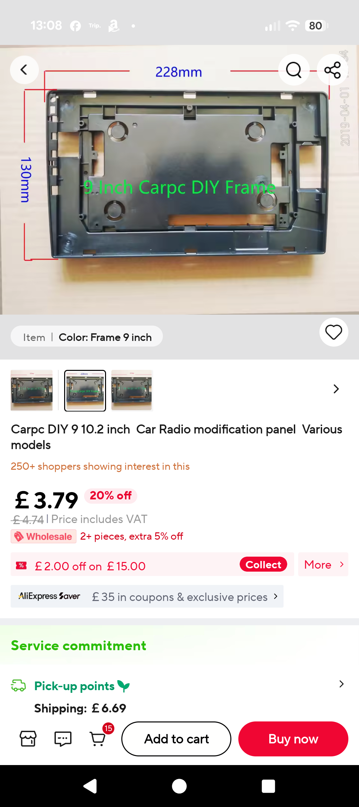
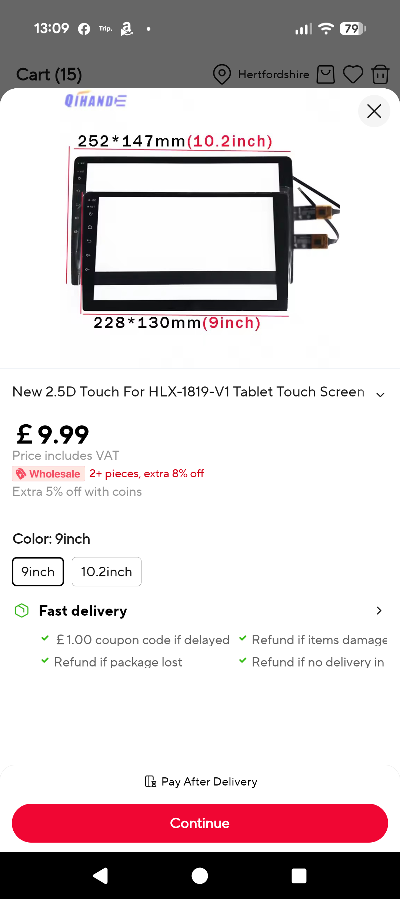
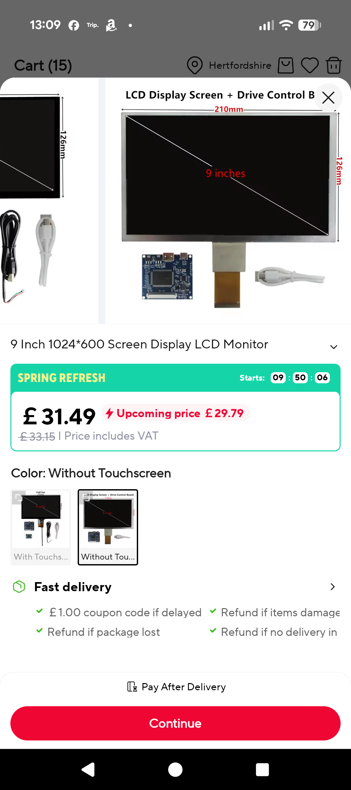

# The display

## 9 Inch

## 9 Inch Dispaly options

These do not have cases

9 Inch Universal LCD Display Screen Monitor Raspberry Pi Driver Control Board Digitizer Touchscreen DIY Computer Secondary Screen
£33.00
Heyman
[Amazon](https://www.amazon.co.uk/Universal-Raspberry-Digitizer-Touchscreen-Secondary/dp/B0DHGC3YCS/ref=sr_1_4?crid=104HRR4126U42&dib=eyJ2IjoiMSJ9.IFTVg0t5yCM31KmdwNOYkYZP884lpxA6Ebgm6SDjmpElf9V1PR77QncQNYZeaGSwepqfLsrlkGW6ynhzH5mEs0Af9Ts_zOTDq2gSTWNvruosftPtC9xhbxdqGiLG20tgI3f55ms5X8G_LwddNY5mOapLWkePa84eHCsHR34N8zuR10G1HoA9R4Dox2xLOzGy_Yd7EE3py1VxHunV8TG7-c4tJphf4Hoft3aDZ-22f1kkqcfhAEBvbhCIU955-A4jqaXP8Th9AkpSfkiw0r5kN0KugZEHnfis_-PmvyIsYY0.cZhkbg95z8gPVFbXu6mEDcZc2nWT7QFfMPCK5FIdJXk&dib_tag=se&keywords=screen+lcd+9+inch&qid=1775598454&s=computers&sprefix=screen+lcd+9+inch%2Ccomputers%2C287&sr=1-4)

---

9 Inch 1024*600 Screen Display LCD Monitor Driver Control Board Digitizer Touchscreen HDMI-Compatible For Orange Raspberry Pi
£47.59
1024*600
Heyman
[Ali](https://www.aliexpress.com/item/1005005346636557.html?spm=a2g0o.productlist.main.2.134c40aeskhitK&algo_pvid=6b04b683-a1cf-42e4-be96-35001f17d961&algo_exp_id=6b04b683-a1cf-42e4-be96-35001f17d961-1&pdp_ext_f=%7B%22order%22%3A%2217%22%2C%22eval%22%3A%221%22%2C%22fromPage%22%3A%22search%22%7D&pdp_npi=6%40dis%21GBP%2133.46%2131.79%21%21%21295.32%21280.58%21%40211b80e117755963769461764e229a%2112000032702391587%21sea%21UK%210%21ABX%211%210%21n_tag%3A-29910%3Bd%3Ab151e39a%3Bm03_new_user%3A-29895&curPageLogUid=DyvdMDeBJn28&utparam-url=scene%3Asearch%7Cquery_from%3A%7Cx_object_id%3A1005005346636557%7C_p_origin_prod%3A)

---

h 1024\*600 LCD Display Screen Digitizer Touchscreen Driver Control Board HDMI-Compatible Raspberry Pi DIY Monitor Kit
1 sold
byHeyman Store (4.8 | 2,000+ sold )
￡ 42.29
[Ali](https://www.aliexpress.com/item/1005006006310260.html?spm=a2g0o.detail.pcDetailTopMoreOtherSeller.7.65921d9cOsFIqZ&gps-id=pcDetailTopMoreOtherSeller&scm=1007.40050.354490.0&scm_id=1007.40050.354490.0&scm-url=1007.40050.354490.0&pvid=8fcb5cab-ae85-4b59-96e0-32e105896c4d&_t=gps-id:pcDetailTopMoreOtherSeller,scm-url:1007.40050.354490.0,pvid:8fcb5cab-ae85-4b59-96e0-32e105896c4d,tpp_buckets:668%232846%238115%232000&pdp_ext_f=%7B%22order%22%3A%221%22%2C%22eval%22%3A%221%22%2C%22sceneId%22%3A%2230050%22%2C%22fromPage%22%3A%22recommend%22%7D&pdp_npi=6%40dis%21GBP%2134.09%2132.39%21%21%21300.88%21285.88%21%40211b80c217755970369391169e34bc%2112000047107135681%21rec%21UK%21%21ABXZ%211%210%21n_tag%3A-29910%3Bd%3Ab151e39a%3Bm03_new_user%3A-29895&utparam-url=scene%3ApcDetailTopMoreOtherSeller%7Cquery_from%3A%7Cx_object_id%3A1005006006310260%7C_p_origin_prod%3A)

---

6.5/7/9/10.1 Inch LCD Screen Display Portable Monitor Driver Control Board Kit For Raspberry Banana/Orange Pi Mini Computer PC
￡ 26.79
1024\*600
[Ali](https://www.aliexpress.com/item/1005004174788588.html?spm=a2g0o.detail.pcDetailTopMoreOtherSeller.10.65921d9cOsFIqZ&gps-id=pcDetailTopMoreOtherSeller&scm=1007.40050.354490.0&scm_id=1007.40050.354490.0&scm-url=1007.40050.354490.0&pvid=8fcb5cab-ae85-4b59-96e0-32e105896c4d&_t=gps-id:pcDetailTopMoreOtherSeller,scm-url:1007.40050.354490.0,pvid:8fcb5cab-ae85-4b59-96e0-32e105896c4d,tpp_buckets:668%232846%238115%232000&pdp_ext_f=%7B%22order%22%3A%2248%22%2C%22eval%22%3A%221%22%2C%22sceneId%22%3A%2230050%22%2C%22fromPage%22%3A%22recommend%22%7D&pdp_npi=6%40dis%21GBP%2123.84%2122.89%21%21%21210.42%21202.04%21%40211b80c217755970369391169e34bc%2112000028285196254%21rec%21UK%21%21ABXZ%211%210%21n_tag%3A-29910%3Bd%3Ab151e39a%3Bm03_new_user%3A-29895&utparam-url=scene%3ApcDetailTopMoreOtherSeller%7Cquery_from%3A%7Cx_object_id%3A1005004174788588%7C_p_origin_prod%3A)

## Reuse current panel

Can I reuse the current panel an digitiser.

Not easily is my current feeling

## 10.1 Inch Display options

| option                                                                                                                                                                                                                                                                                                                                                                                                                                                                                                                                                                                                                                                                                                                                                                                                             | brigtness                    | enclosude | price |
| ------------------------------------------------------------------------------------------------------------------------------------------------------------------------------------------------------------------------------------------------------------------------------------------------------------------------------------------------------------------------------------------------------------------------------------------------------------------------------------------------------------------------------------------------------------------------------------------------------------------------------------------------------------------------------------------------------------------------------------------------------------------------------------------------------------------ | ---------------------------- | --------- | ----- |
|   10.1 inch 1280x800 IPS MPI1008 http://www.lcdwiki.com/10.1inch_HDMI_Display-Y                                                                                                                                                                                                                                                                                                                                                                                                                                                                                                                                                                                                                                                                     | 220cd/m2 button addjustment  | plastic   | ~£50  |
|                             | 350 cd/m2                    | none      | ~£50  |
|  10.1 Inch 1280\*800 TFT EJ101IA-01G HD LCD Display Touch Screen Remote Driver Board 2AV VGA For Raspberry Pi 3 [AliEpress](https://www.aliexpress.com/item/32920662451.html?spm=a2g0o.productlist.main.5.493a753ezUSlru&algo_pvid=bfda887a-1491-4815-ba0a-dcd24c721d4c&algo_exp_id=bfda887a-1491-4815-ba0a-dcd24c721d4c-4&pdp_ext_f=%7B%22order%22%3A%2217%22%2C%22eval%22%3A%221%22%2C%22fromPage%22%3A%22search%22%7D&pdp_npi=6%40dis%21GBP%2158.30%2140.81%21%21%2174.88%2152.41%21%40211b612517753430462841646e6a3c%2112000042152825609%21sea%21UK%210%21ABX%211%210%21n_tag%3A-29910%3Bd%3A72912a7b%3Bm03_new_user%3A-29895%3BpisId%3A5000000197842856&curPageLogUid=T1BA53JcnbQe&utparam-url=scene%3Asearch%7Cquery_from%3A%7Cx_object_id%3A32920662451%7C_p_origin_prod%3A) | 350 cd/m2                    | none      | ~£50  |
|  ROADOM Touch Screen with Case, 10.1’’ Raspberry Pi Screen, IPS FHD 1024×600,Responsive and Smooth Touch,Dual Built-in Speakers,HDMI Input,Compatible with Raspberry Pi 5/4/3/Zero [Amazon](https://www.amazon.co.uk/ROADOM-Raspberry-1024%C3%97600-Responsive-Compatible/dp/B0DPW4KDR8/ref=asc_df_B0DPW4KDR8?mcid=8b5602a71926328baf9a6775c58ac75d&tag=googshopuk-21&linkCode=df0&hvadid=732381739151&hvpos=&hvnetw=g&hvrand=12352195671574543887&hvpone=&hvptwo=&hvqmt=&hvdev=c&hvdvcmdl=&hvlocint=&hvlocphy=9045980&hvtargid=pla-2402559317518&hvocijid=12352195671574543887-B0DPW4KDR8-&hvexpln=0&gad_source=1&th=1)                                                                                                                                                          |                              | plastic   | £69   |
|  10.1 inch 1280x800 Capacitive Touch Screen. Connections on side. NOT SUITABLE https://www.lcdwiki.com/10.1inch_HDMI_Display-S                                                                                                                                                                                                                                                                                                                                                                                                                                                                                                                                                                                                                                                 | 250 cd/m2 rotarty adjusrment | metal     |       |
