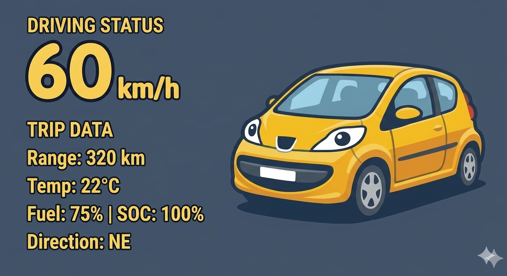
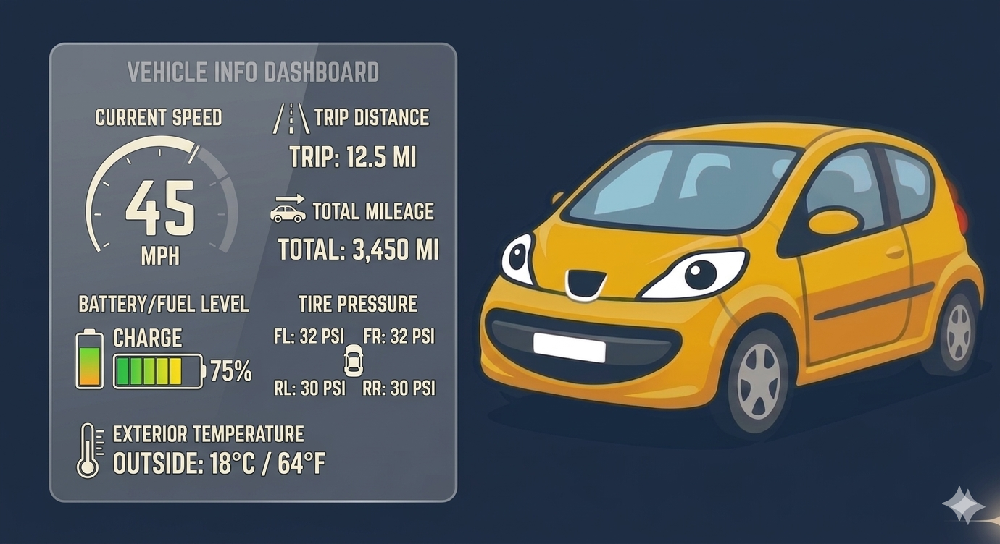
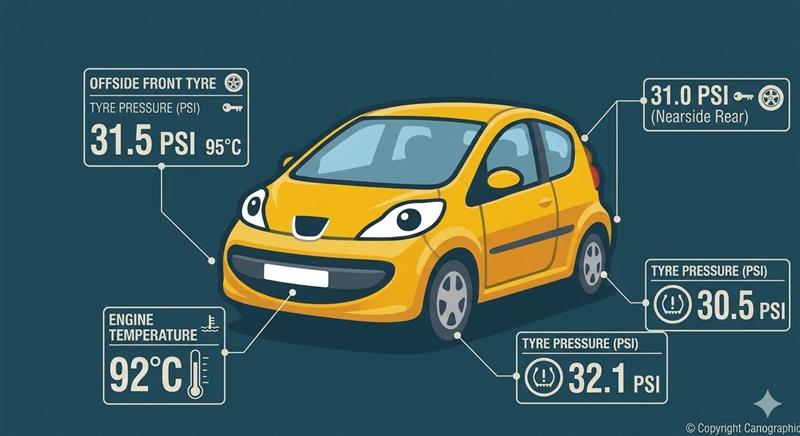
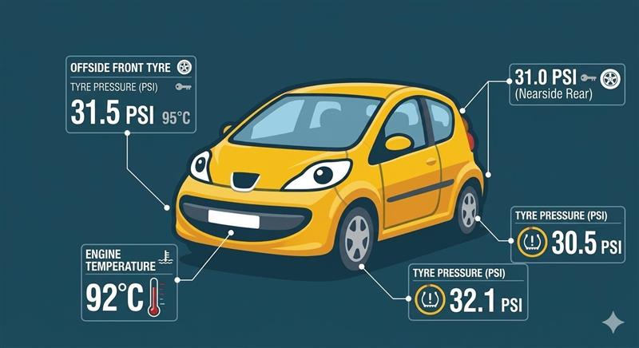
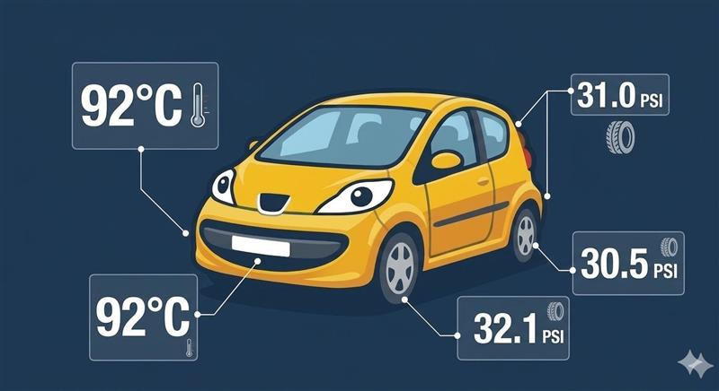
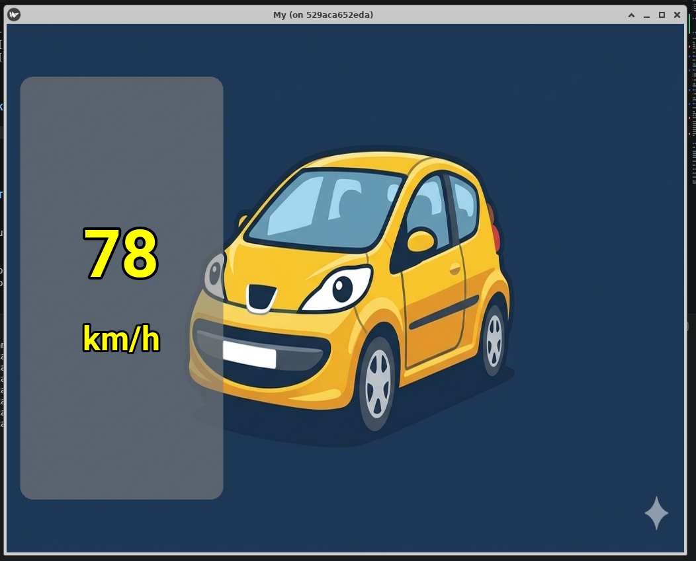

# GUI development

For the moment I've just vibes something with TKInter, this may not be my final solution.

[discussions](discussions/tkinter.md)

The initial plan is make something like this:

| 1 | notes |
| -- | -- |
|  | |
|  | |
|  | |
|  | |
|  | |
|  | |


## Kivy

Kivy (The "Modern" Python Choice)
If you want to stay in Python, Kivy is significantly better for a head unit than Tkinter.
How it works: It uses OpenGL ES 2, meaning it uses the GPU to "compose" the UI.
Efficiency: It’s designed for touch. It handles multi-touch, swipes, and pinches natively.
The "Compositor" aspect: Kivy uses a graphics pipeline where you can define "instruction groups." It’s much faster than drawing individual boxes in Tkinter.

## test1 

just a simple getting started

### test2

- Grey rounded panel on the left (30% wide, 80% tall)
- Displays live speed (large yellow text with black outline) and "km/h" label via MQTT (`car/speed`)
- Background image switchable with keys `1`/`2`/`3` (publishes to `car/HU/bg_image`)
- Fullscreen mode: `python test2.py --fullscreen` — press Escape to exit
- Uses Kivy `RoundedRectangle` and `Clock.schedule_once` for thread-safe MQTT updates




## TKInter


Setup:

```
sudo apt-get update
sudo apt-get install python3-tk
pip install -r requirements.txt

```

### Test1

Just an example


### Test2

- Uses MQTT ( speed published with pub.py car/speed )
- background image can be change with keys 1,2,3. message published to car/HU/bg_image

- uses a bit of hack to fix the corner issue - it fills with the top left colour of the backround image


### Test3

- Compositing with PIL. this handles transparncy and test outline.


### font

https://www.1001fonts.com/nunito-font.html

```
mkdir /usr/share/fonts/truetype/custom
cp nunito.black.ttf /usr/share/fonts/truetype/custom/.
fc-cache -f -v

root@529aca652eda:/workspace/PiHU/gui/test# python3 ./testfont.py
('Standard Symbols PS', 'Century Schoolbook L', 'DejaVu Math TeX Gyre', 'URW Gothic', 'CustomTkinter_shapes_font', 'Nunito', 'Nimbus Roman', 'DejaVu Sans Mono', 'Roboto', 'URW Palladio L', 'Nimbus Sans', 'URW Gothic L', 'Dingbats', 'URW Chancery L', 'FreeSerif', 'Nimbus Mono PS', 'DejaVu Sans', 'Nimbus Sans Narrow', 'URW Bookman', 'DejaVu Sans', 'DejaVu Serif', 'Noto Sans Mono', 'DejaVu Sans', 'C059', 'Liberation Sans Narrow', 'Liberation Mono', 'Nimbus Sans L', 'Droid Sans Fallback', 'Z003', 'Standard Symbols L', 'D050000L', 'Nimbus Mono L', 'Roboto', 'Liberation Serif', 'Nimbus Roman No9 L', 'Liberation Sans', 'FreeSans', 'Noto Mono', 'P052', 'DejaVu Serif', 'FreeMono', 'URW Bookman L')
```


## Future develoment


