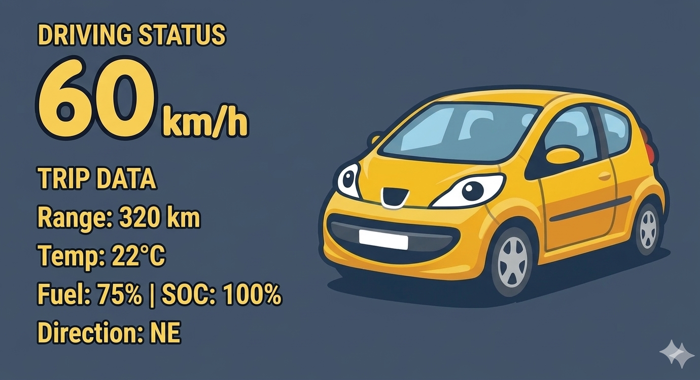
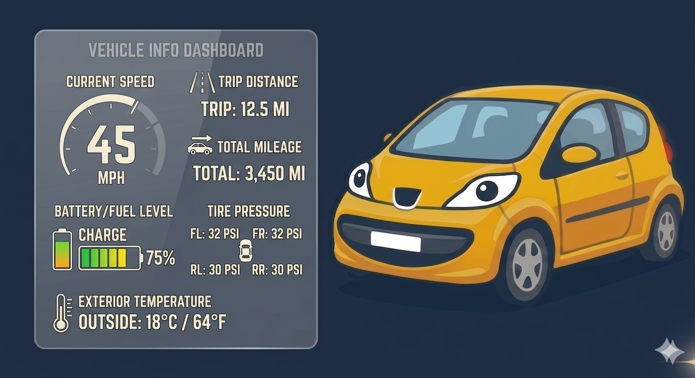
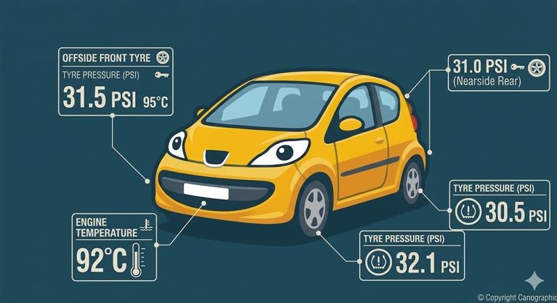
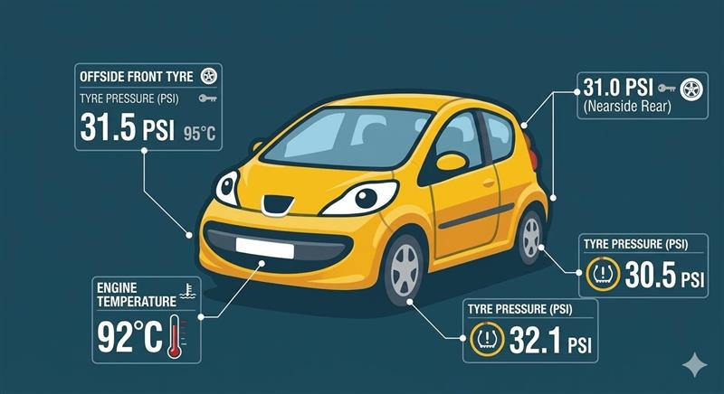
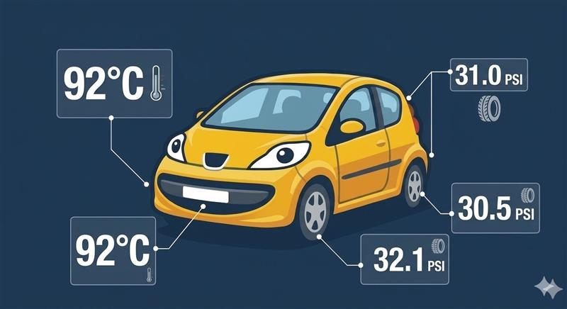

# GUI

The initial plan is make something like this:

| 1                                   | notes |
| ----------------------------------- | ----- |
|  |       |
|  |       |
|       |       |
|       |       |
|       |       |
|       |       |

## Kivy

Kivy (The "Modern" Python Choice)
If you want to stay in Python, Kivy is significantly better for a head unit than Tkinter.
How it works: It uses OpenGL ES 2, meaning it uses the GPU to "compose" the UI.
Efficiency: It’s designed for touch. It handles multi-touch, swipes, and pinches natively.
The "Compositor" aspect: Kivy uses a graphics pipeline where you can define "instruction groups." It’s much faster than drawing individual boxes in Tkinter.
