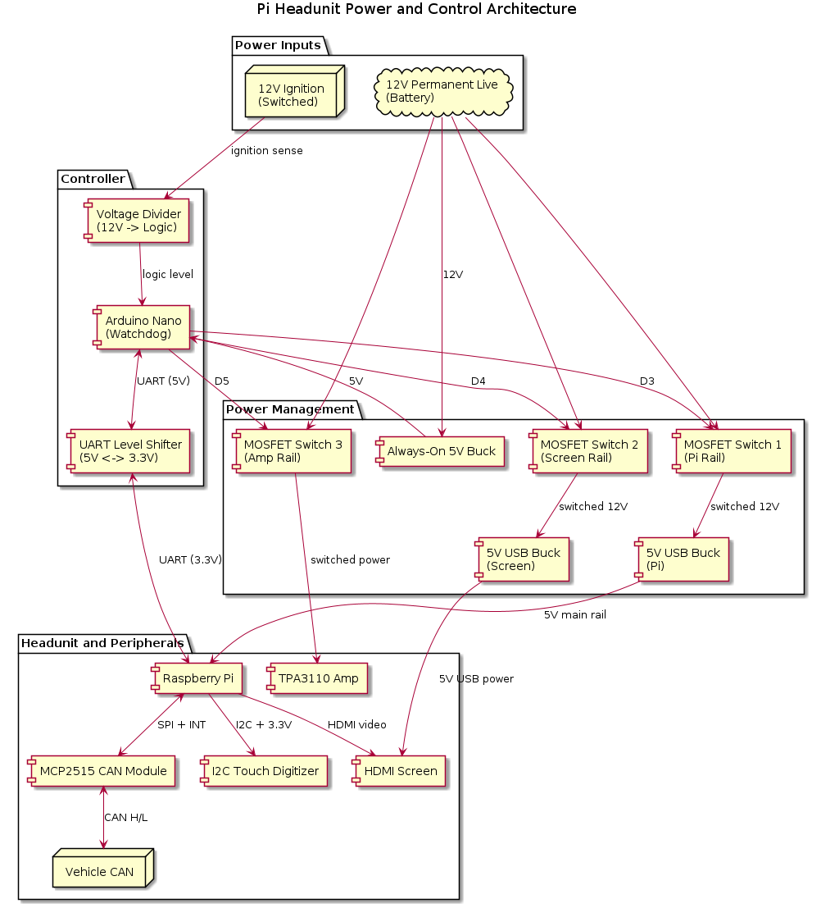

# Power

Plan is to have an arduino to manage power

```
─────────────────────────────────── [ +12V PERMANENT LIVE (Car Battery) ] ────────────────────────────────────
       │                         │                           │                             │
       │                         ├───[Switch 1: MOSFET]      ├───[Switch 2: MOSFET]        └───[Switch 3: MOSFET]
       │                         │      (Pi Power)           │      (Screen Power)              (Amp Power)
       ▼                         ▼                           ▼                             ▼
 ┌───────────┐             ┌───────────┐               ┌───────────┐                 ┌───────────┐
 │ 12V to 5V │             │ 12V to 5V │               │  Screen   │                 │  TPA3110  │
 │ Buck Reg. │             │ Buck Reg. │               │ Power Rail│                 │ Amplifier │
 └─────┬─────┘             └─────┬─────┘               └─────┬─────┘                 └─────┬─────┘
       │                         │                           │                             │
       ▼                         ▼                           ▼                             ▼
 ┌───────────┐             ┌───────────────────────────────────────┐                       │
 │  ARDUINO  │             │             RASPBERRY PI              │                       │
 │ (Watchdog)│             │               (Headunit)              │                       │
 └─────┬─────┘             └─────┬───────────────┬───────────┬─────┘                       │
       │                         │               │           │                             │
       │◄─── [UART + Level] ─────┘               │           │                             │
       │     (Pins 8 & 10)                       │           │                             │
       │                                         ▼           ▼                             ▼
 ┌─────┴─────┐                             ┌───────────┐ ┌───────────┐               ┌───────────┐
 │ IGNITION  │                             │  MCP2515  │ │Touchscreen│               │ Speakers  │
 │  SENSE    │                             │  CAN Bus  │ │HDMI Panel │               │ (30W+30W) │
 │ (12V Sw.) │                             └─────┬─────┘ └───────────┘               └───────────┘
 └───────────┘                                   │           ▲
                                                 ▼           │ (HDMI Video)
                                           ┌───────────┐     │
                                           │  Vehicle  │ ┌───┴───────┐
                                           │  CAN Network│ │ Digitizer │
                                           └───────────┘ │ (I2C 3.3V)│
                                                         └───────────┘
 ─────────────────────────────────────────────── [ GROUND (GND) ] ───────────────────────────────────────────────
```


<details>
<summary>View UML</summary>

```uml
skinparam componentStyle rectangle
skinparam BackgroundColor #FFFFFF

title Pi Headunit Power and Control Architecture

package "Power Inputs" {
  cloud "12V Permanent Live\n(Battery)" as BATT
  node "12V Ignition\n(Switched)" as IGN
}

package "Power Management" {
  component "Always-On 5V Buck" as BUCK_AO
  component "MOSFET Switch 1\n(Pi Rail)" as SW_PI
  component "MOSFET Switch 2\n(Screen Rail)" as SW_SCREEN
  component "MOSFET Switch 3\n(Amp Rail)" as SW_AMP
  component "5V USB Buck\n(Pi)" as BUCK_PI
  component "5V USB Buck\n(Screen)" as BUCK_SCREEN
}

package "Controller" {
  component "Arduino Nano\n(Watchdog)" as MCU
  component "Voltage Divider\n(12V -> Logic)" as DIV
  component "UART Level Shifter\n(5V <-> 3.3V)" as LVL
}

package "Headunit and Peripherals" {
  component "Raspberry Pi" as PI
  component "MCP2515 CAN Module" as MCP
  node "Vehicle CAN" as CANBUS
  component "HDMI Screen" as SCREEN
  component "I2C Touch Digitizer" as TOUCH
  component "TPA3110 Amp" as AMP
}

BATT --> BUCK_AO : 12V
BUCK_AO --> MCU : 5V

BATT --> SW_PI
BATT --> SW_SCREEN
BATT --> SW_AMP

SW_PI --> BUCK_PI : switched 12V
BUCK_PI --> PI : 5V main rail
SW_SCREEN --> BUCK_SCREEN : switched 12V
BUCK_SCREEN --> SCREEN : 5V USB power
SW_AMP --> AMP : switched power

IGN --> DIV : ignition sense
DIV --> MCU : logic level

MCU --> SW_PI : D3
MCU --> SW_SCREEN : D4
MCU --> SW_AMP : D5

MCU <--> LVL : UART (5V)
LVL <--> PI : UART (3.3V)

PI <--> MCP : SPI + INT
MCP <--> CANBUS : CAN H/L
PI --> SCREEN : HDMI video
PI --> TOUCH : I2C + 3.3V

```
</details>


<details>
<summary>View UML</summary>

```uml
@startuml
skinparam backgroundColor #FFFFFF
skinparam state {
  StartColor #000000
  EndColor #000000
  BackgroundColor #F4F4F4
  BorderColor #333333
  FontName Arial
}

[*] --> STANDBY : System Hooked to Permanent 12V

state STANDBY {
  [*] --> Idle_LowPower
  Idle_LowPower : - Arduino Awake
  Idle_LowPower : - Switch 1 (Pi) OFF
  Idle_LowPower : - Switch 2 (Screen) OFF
  Idle_LowPower : - Switch 3 (Amp) OFF
}

STANDBY --> BOOT_SEQUENCE : Ignition ON Detected\n(D2 goes HIGH)

state BOOT_SEQUENCE {
  [*] --> Power_Host
  Power_Host : - Switch 1 (Pi) -> ON
  Power_Host : - Switch 2 (Screen) -> ON
  Power_Host : - Wait 20 seconds for OS & MQTT Stability

  Power_Host --> Unmute_Audio : Timeout Expires
  Unmute_Audio : - Switch 3 (Amp) -> ON
}

BOOT_SEQUENCE --> SYSTEM_RUNNING : Sequence Complete

state SYSTEM_RUNNING {
  SYSTEM_RUNNING : - Headunit Fully Operational
  SYSTEM_RUNNING : - Arduino polls Ignition pin
  SYSTEM_RUNNING : - Pi UI & Digitizer Active
}

SYSTEM_RUNNING --> SHUTDOWN_SEQUENCE : Ignition OFF Detected\n(D2 goes LOW)

state SHUTDOWN_SEQUENCE {
  [*] --> Instant_Kill
  Instant_Kill : - Switch 3 (Amp) -> OFF (No Audio Pop!)
  Instant_Kill : - Switch 2 (Screen) -> OFF (Instant Black Screen)

  Instant_Kill --> Signal_Host : Immediate Transition
  Signal_Host : - Send "SHUTDOWN_NOW" over UART
  Signal_Host : - Wait 15 seconds for File System Unmount

  Signal_Host --> Power_Cut : Timeout Expires
  Power_Cut : - Switch 1 (Pi) -> OFF
}

SHUTDOWN_SEQUENCE --> STANDBY : Sequence Complete

@enduml

```

</details>
