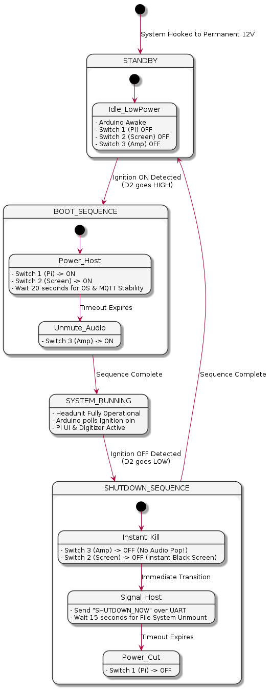

# Power

Plan is to have an arduino to manage power

```
─────────────────────────────────── [ +12V PERMANENT LIVE (Car Battery) ] ────────────────────────────────────
       │                         │                           │                             │
       │                         ├───[Switch 1: MOSFET]      ├───[Switch 2: MOSFET]        └───[Switch 3: MOSFET]
       │                         │      (Pi Power)           │      (Screen Power)              (Amp Power)
       ▼                         ▼                           ▼                             ▼
 ┌───────────┐             ┌───────────┐               ┌───────────┐                 ┌───────────┐
 │ 12V to 5V │             │ 12V to 5V │               │  Screen   │                 │  TPA3110  │
 │ Buck Reg. │             │ Buck Reg. │               │ Power Rail│                 │ Amplifier │
 └─────┬─────┘             └─────┬─────┘               └─────┬─────┘                 └─────┬─────┘
       │                         │                           │                             │
       ▼                         ▼                           ▼                             ▼
 ┌───────────┐             ┌───────────────────────────────────────┐                       │
 │  ARDUINO  │             │             RASPBERRY PI              │                       │
 │ (Watchdog)│             │               (Headunit)              │                       │
 └─────┬─────┘             └─────┬───────────────┬───────────┬─────┘                       │
       │                         │               │           │                             │
       │◄─── [UART + Level] ─────┘               │           │                             │
       │     (Pins 8 & 10)                       │           │                             │
       │                                         ▼           ▼                             ▼
 ┌─────┴─────┐                             ┌───────────┐ ┌───────────┐               ┌───────────┐
 │ IGNITION  │                             │  MCP2515  │ │Touchscreen│               │ Speakers  │
 │  SENSE    │                             │  CAN Bus  │ │HDMI Panel │               │ (30W+30W) │
 │ (12V Sw.) │                             └─────┬─────┘ └───────────┘               └───────────┘
 └───────────┘                                   │           ▲
                                                 ▼           │ (HDMI Video)
                                           ┌───────────┐     │
                                           │  Vehicle  │ ┌───┴───────┐
                                           │  CAN Network│ │ Digitizer │
                                           └───────────┘ │ (I2C 3.3V)│
                                                         └───────────┘
 ─────────────────────────────────────────────── [ GROUND (GND) ] ───────────────────────────────────────────────
```

```uml
@startuml
skinparam componentStyle rectangle
skinparam BackgroundColor #FFFFFF
skinparam DefaultFontName Arial

title Custom Pi Headunit - Power Control & Component Wiring Architecture

' Define Power Sources
cloud "12V Permanent Live\n(Car Battery)" as Perm12V #DarkRed;text:white
node "12V Switched Live\n(Ignition Switch)" as Ign12V #Orange;text:black

' Define Regulators and Switches
package "Power Management Panel" {
    component "Always-On 5V Buck" as NanoBuck #LightGray
    component "Switch 1: P-CH MOSFET\n(Pi Main Power)" as Sw1 #Pink
    component "Switch 2: P-CH MOSFET\n(HDMI Display Power)" as Sw2 #Pink
    component "Switch 3: P-CH MOSFET\n(TPA3110 Amp Power)" as Sw3 #Pink
    component "High-Current 5V Buck\n(Pi Dedicated Regulator)" as PiBuck #LightGray
}

' Define Control Units
package "Logic & Data Core" {
    component "Arduino Nano\n(Power Watchdog)" as Arduino #LightBlue
    component "Raspberry Pi Headunit\n(MQTT Broker / Core UI)" as Pi #LightGreen
    component "Voltage Divider\n(12V -> 4V Sense)" as VolDiv #LightYellow
    component "UART Level Shifter\n(5V <-> 3.3V)" as LvlShift #LightYellow
}

' Define Peripherals
package "Peripherals & Networking" {
    component "MCP2515 Module\n(CAN Controller)" as MCP #LightCyan
    component "HDMI Screen Panel\n(Display Panel)" as Display #NavajoWhite
    component "I2C Touchscreen Digitizer" as Digitizer #NavajoWhite
    component "TPA3110 Audio Amp\n(30W + 30W Board)" as Amp #Thistle
    node "Vehicle CAN Bus\n(OBD-II Interface)" as CarCAN #Gray;text:white
}

' --- POWER ROUTING CONSTRAINTS ---
Perm12V --> NanoBuck : Raw 12V In
NanoBuck --> Arduino : Clean 5V VCC

Perm12V --> Sw1 : High-Side Supply
Perm12V --> Sw2 : High-Side Supply
Perm12V --> Sw3 : High-Side Supply

Sw1 --> PiBuck : Switched 12V
PiBuck --> Pi : Clean 5V (Main Input)

Sw2 --> Display : Switched 12V (or 5V Power)
Sw3 --> Amp : Switched 12V Main VCC

' --- IGNITION SENSING ---
Ign12V --> VolDiv : 12V Ignition Trigger
VolDiv --> Arduino : Safe 4.2V Logic Signal (Pin D2)

' --- ARDUINO MOSFET CONTROL LINES ---
Arduino -[#blue]-> Sw1 : Logic Control (Pin D3)
Arduino -[#blue]-> Sw2 : Logic Control (Pin D4)
Arduino -[#blue]-> Sw3 : Logic Control (Pin D5)

' --- COMMUNICATION AND INTERFACES ---
Arduino <.[#green].> LvlShift : UART (5V TTL)
LvlShift <.[#green].> Pi : UART Pins 8 & 10 (3.3V TTL)

Pi <.[#orange].> MCP : SPI Bus + Interrupt Pin
MCP <-> CarCAN : Differential CAN Transceiver Signaling

Pi ---> Display : HDMI Video Feed
Pi -[#purple]-> Digitizer : I2C Data & Interrupt Lines
Pi -[#purple]-> Digitizer : 3.3V Native Bus Power

' Grounding reference
note to right of Arduino
  All components share a common
  chassis vehicle Ground (GND)
end note

@enduml

```



<details>
<summary>View UML</summary>

```uml
@startuml
skinparam backgroundColor #FFFFFF
skinparam state {
  StartColor #000000
  EndColor #000000
  BackgroundColor #F4F4F4
  BorderColor #333333
  FontName Arial
}

[*] --> STANDBY : System Hooked to Permanent 12V

state STANDBY {
  [*] --> Idle_LowPower
  Idle_LowPower : - Arduino Awake
  Idle_LowPower : - Switch 1 (Pi) OFF
  Idle_LowPower : - Switch 2 (Screen) OFF
  Idle_LowPower : - Switch 3 (Amp) OFF
}

STANDBY --> BOOT_SEQUENCE : Ignition ON Detected\n(D2 goes HIGH)

state BOOT_SEQUENCE {
  [*] --> Power_Host
  Power_Host : - Switch 1 (Pi) -> ON
  Power_Host : - Switch 2 (Screen) -> ON
  Power_Host : - Wait 20 seconds for OS & MQTT Stability

  Power_Host --> Unmute_Audio : Timeout Expires
  Unmute_Audio : - Switch 3 (Amp) -> ON
}

BOOT_SEQUENCE --> SYSTEM_RUNNING : Sequence Complete

state SYSTEM_RUNNING {
  SYSTEM_RUNNING : - Headunit Fully Operational
  SYSTEM_RUNNING : - Arduino polls Ignition pin
  SYSTEM_RUNNING : - Pi UI & Digitizer Active
}

SYSTEM_RUNNING --> SHUTDOWN_SEQUENCE : Ignition OFF Detected\n(D2 goes LOW)

state SHUTDOWN_SEQUENCE {
  [*] --> Instant_Kill
  Instant_Kill : - Switch 3 (Amp) -> OFF (No Audio Pop!)
  Instant_Kill : - Switch 2 (Screen) -> OFF (Instant Black Screen)

  Instant_Kill --> Signal_Host : Immediate Transition
  Signal_Host : - Send "SHUTDOWN_NOW" over UART
  Signal_Host : - Wait 15 seconds for File System Unmount

  Signal_Host --> Power_Cut : Timeout Expires
  Power_Cut : - Switch 1 (Pi) -> OFF
}

SHUTDOWN_SEQUENCE --> STANDBY : Sequence Complete

@enduml

```

</details>
