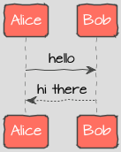
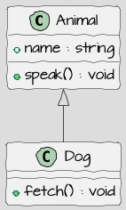

# Test file for updatemd.py

Some introductory text.

## Sequence diagram



<details>
<summary>View UML</summary>


<details>
<summary>View UML</summary>

```uml
Alice -> Bob : hello
Bob --> Alice : hi there
```
</details>

</details>

## Class diagram



<details>
<summary>View UML</summary>


<details>
<summary>View UML</summary>

```uml
class Animal {
  +name : string
  +speak() : void
}

class Dog {
  +fetch() : void
}

Animal <|-- Dog
```
</details>

</details>

## Flow diagram / Activity diagram


<details>
<summary>View UML</summary>


<details>
<summary>View UML</summary>

```uml
start
:Process starts;
if (Condition met?) then (yes)
  :Execute task A;
  :Execute task B;
else (no)
  :Skip tasks;
endif
:Process ends;
stop
```
</details>

</details>

## End

That's all.
